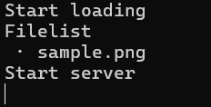
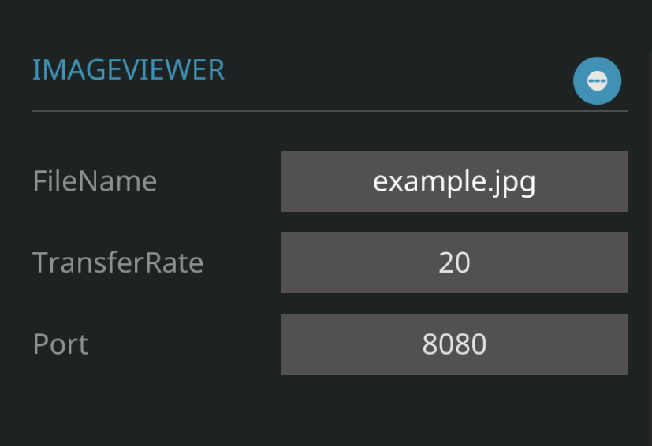

# StormworksImageServer

このツールはStormworks内で画像ファイルを表示するための使用するものです。

表示用のマイコンとサンプルビークルはこちら
https://steamcommunity.com/sharedfiles/filedetails/?id=3268880215

### 機能
- 同時に複数の画像の表示
- あらゆるサイズのモニタに対して自動調整表示(モニタのサイズ合わせてクロップ)

# 使い方
### 1. 実行環境の構築
本ツールはPythonを用いて作成されているため、Pythonの実行環境が必要です。インストールについてはPython公式サイトやMicrosoftストアから行ってください。 

内部での画像処理のためOpenCVを使用しているため下記のコマンドを用いてライブラリのインストールをしてください。 
`pip install opencv-python` 

## 2. ツールのダウンロード
右上の緑色の「Code」ボタン-DowloadZIPからファイルをダウンロード後ファイルを解凍してください。

## 3. 表示用の画像の準備
展開したフォルダ配下にあるimageフォルダ内に画像ファイルを配置してください。 

画像ファイルの形式はjpgとpngに対応しています。

### 4. ツールの起動
ツールが配置されているフォルダ内で以下のコマンドを実行 
`python image_server.py`

ツール起動後、利用可能なファイルの一覧が表示されます

## 5. ビークルの設定
サブスクライブしたビークルをワークベンチ開きでマイコンの以下の項目の設定を行ってください
- FileName: 参照するファイル名(拡張子も含めて入力)
- TransferRate : 一度に送信する列数
- Port: ツールとの接続に使用するポート番号(デフォルトでは8080に設定)

## 6. 画像の表示
ビークルについているスイッチをオンにすることで画像の読み込みが行われます。オフにした後再度オンにした場合は再度読み込みが行われます。設定されたファイル名が存在しない場合は「FILE NOT FOUND」と表示されます。

# 注意点
- モニターの解像度に合わせて1ピクセルずつ描画するため負荷が高く大型モニタを複数配置するとPFSの低下が発生します
- マイコンのビデオノードに複数のモニタを接続する際は同じサイズのものにしてください